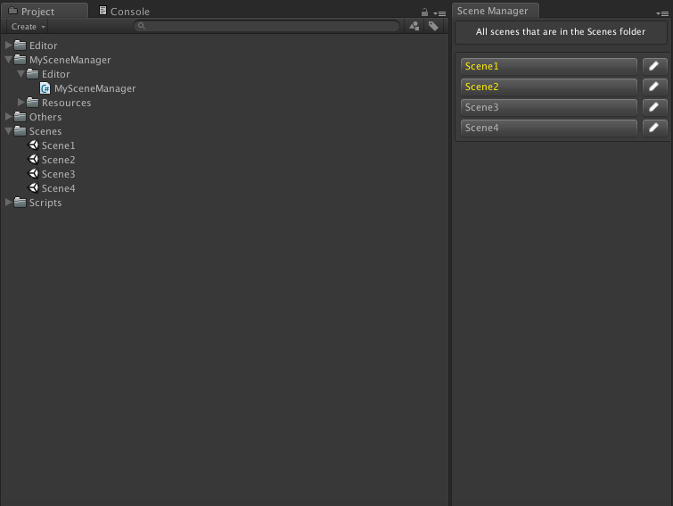

# My Scene Manager [WIP]

This is a simple tool to manage your game scenes.

[Download](https://github.com/prashant-singh/my-scene-manager/releases)

## Click on the buttons to load the scene right away.
## You can rename the scene right away by clicking on the pencil icon.
## Yellow text on button indicates that that scene is added to the build settings.

This is compatible with the Unity3D 5.2 version not yet supported for Unity3D 5.3.x versions.(will be)

